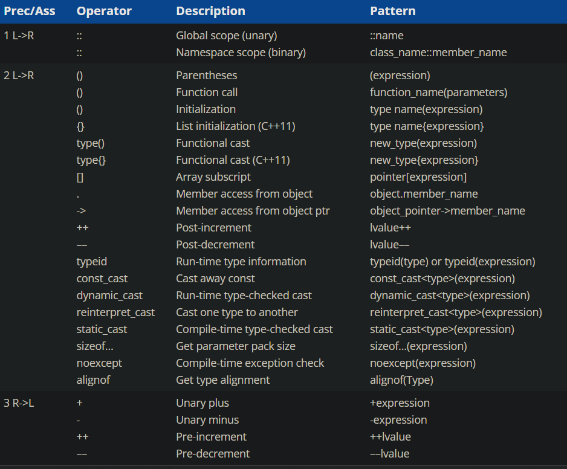

# Table of operator precedence and associativity

- Precedence level 1 is the highest precedence level, and level 17 is the lowest. Operators with a higher precedence level have their operands grouped first.
- L->R means left to right associativity.
- R->L means right to left associativity.

refer : [LearnCpp](https://www.learncpp.com/cpp-tutorial/operator-precedence-and-associativity/) , [cppreference.com](https://en.cppreference.com/w/c/language/operator_precedence)
