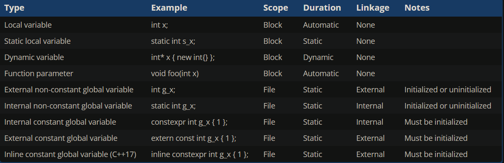
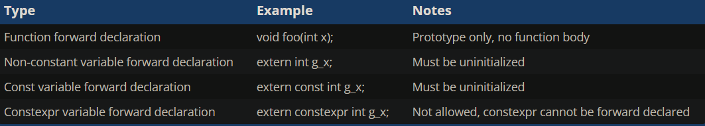
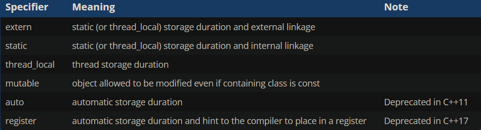

# __Scope summary__

An identifier’s scope determines where the identifier can be accessed within the source code.

- Variables with __block (local) scope__ can only be accessed from the point of declaration until the end of the block in which they are declared (including nested blocks). This includes:
    - Local variables
    - Function parameters
    - User-defined type definitions (such as enums and classes) declared inside a block
- Variables and functions with __file (global) scope__ can be accessed from the point of declaration until the end of the file. This includes:
    - Global variables
    - Functions
    - User-defined type definitions (such as enums and classes) declared inside a namespace or in the global scope
      
---
# __Duration summary__

A variable’s duration determines when it is created and destroyed.

- Variables with __automatic duration__ are created at the point of definition, and destroyed when the block they are part of is exited. This includes:
    - Local variables
    - Function parameters
- Variables with __static duration__ are created when the program begins and destroyed when the program ends. This includes:
    - Global variables
    - Static local variables
- Variables with __dynamic duration__ are created and destroyed by programmer request. This includes:
    - Dynamically allocated variables

---
# __Linkage summary__

An identifier’s linkage determines whether multiple declarations of an identifier refer to the same entity (object, function, reference, etc…) or not.

- An identifier with __no linkage__ means the identifier only refers to itself. This includes:
    - Local variables
    - User-defined type definitions (such as enums and classes) declared inside a block

- An identifier with __internal linkage__ can be accessed anywhere within the file it is declared. This includes:
    - Static global variables (initialized or uninitialized)
    - Static functions
    - Const global variables
    - Functions declared inside an unnamed namespace
    - User-defined type definitions (such as enums and classes) declared inside an unnamed namespace

- An identifier with __external linkage__ can be accessed anywhere within the file it is declared, or other files (via a forward declaration). This includes:
    - Functions
    - Non-const global variables (initialized or uninitialized)
    - Extern const global variables
    - Inline const global variables
    - User-defined type definitions (such as enums and classes) declared inside a namespace or in the global scope

Identifiers with external linkage will generally cause a duplicate definition linker error if the definitions are compiled into more than one .cpp file (due to violating the one-definition rule). There are some exceptions to this rule (for types, templates, and inline functions and variables) -- we’ll cover these further in future lessons when we talk about those topics.

Also note that functions have external linkage by default. They can be made internal by using the static keyword.

---
# __Variable scope, duration, and linkage summary__

# __Forward declaration summary__

You can use a forward declaration to access a function or variable in another file. 

# __storage class specifier__

When used as part of an identifier declaration, the static and extern keywords are called storage class specifiers. In this context, they set the storage duration and linkage of the identifier.

